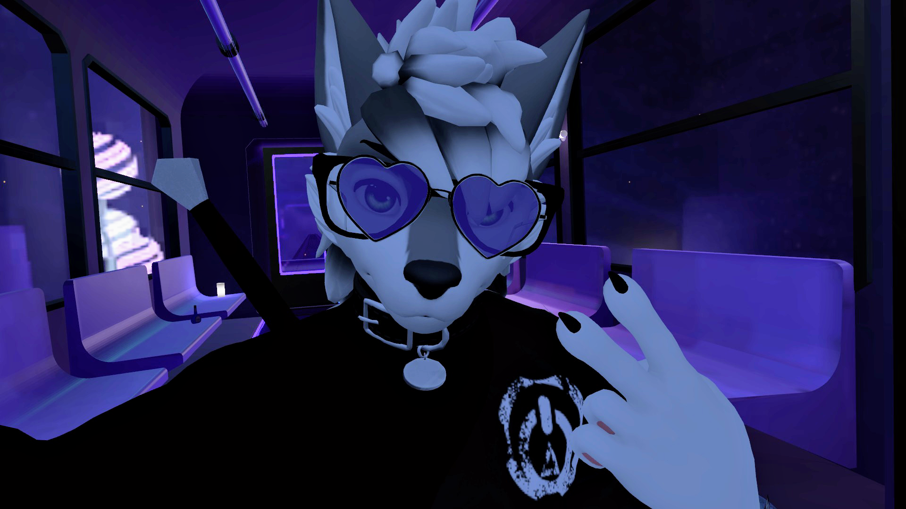
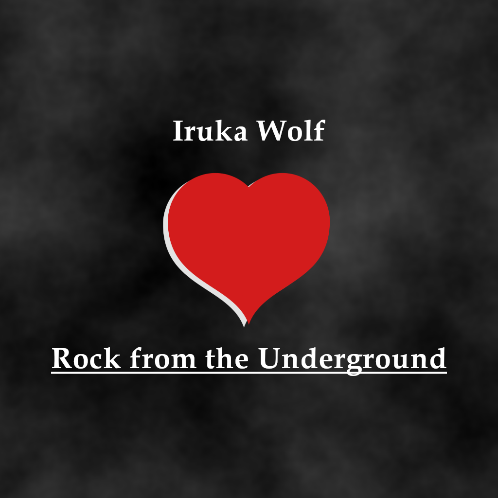

### **An indie artist / VTuber here to prove that anyone can make music using 100% free software.**

I use [LMMS](https://lmms.io/) (specifically the 1.3.0 alpha) as my DAW with the [SGM v2.01 Soundfont](https://musical-artifacts.com/artifacts/855) to write music, both of which are completely free with no royalties.

In spite of its popularity, this specific version of SGM seems to be abandonware as there is no official download for it, only a multitude of afficionado uploads.

Nevertheless, that's all I use for production! I use [Audacity](https://www.audacityteam.org/) for post-production and [ShotCut](www.shotcut.org) for video creation, both of which are free as well. I am a proponent of free and especially open-source software to enable amateurs like me and even professionals to exercise their creative freedoms.

---

# About Me

I’m a furry from the midwest with a passion for video games and music! I make original instrumentals and occasionally do video game music covers.

I tend to write in two distinct styles: **orchestral** and **instrumental rock**.

80's and 2000's Rock is my main inspiration for the latter, so expect a plethora of power chords and even more powerful drums!

As for the former, I draw inspiration from many games from my childhood and games I'm continuing to discover today. Composers like Koji Kondo, Motoi Sakuraba, and Nobuo Uematsu are my greatest role-models.

---

# Follow my personal music endeavors on [YouTube](https://www.youtube.com/@iruka_wolf)!

I create music almost daily, as it's a hobby and creative outlet like no other. However, most of my works never see the light of day. If something comes out good enough, I'll post it on YouTube!

Albums and EPs will be uploaded to both YouTube and SoundCloud.

---

## Like my music? Support me on Ko-fi!

*I also take music commissions of Ko-fi as well!*

*Due to financial troubles, I unfortunately had to cancel my DistroKid Account, so this is the only way to show your support financially!*

For business inquiries, reach out to me at **[irukawolf@proton.me](mailto:irukawolf@proton.me)**.

---

# Music Streaming available on:
  

### Starting with Foray Into Nothing, my discography will be available for purchase through Bandcamp!

*All music is uploaded personally to YouTube, with notable releases also going to SoundCloud and posted for sale on Bandcamp.*

---

# Discography (Sorted by Latest)

## Upcoming Release(s):

*Instrumental Rock Album slated for late 2025/early 2026.*

## The following are available only on SoundCloud:

*Original Single*

*Original Album*

*Original Single*

*Cover EP*
