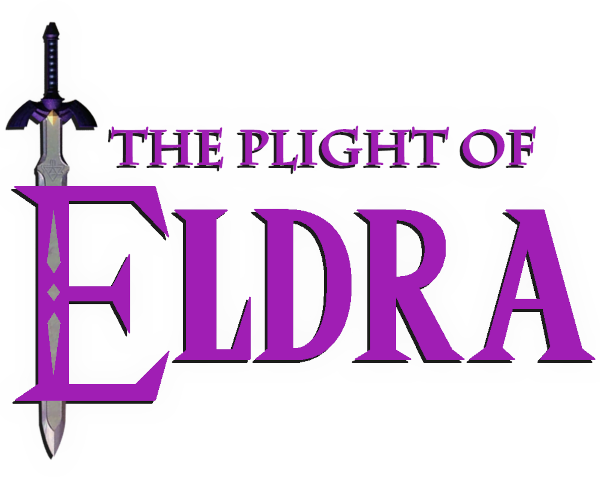

# About Me

I'm an Ivy Tech student studying Computer Science with a passion for video games and music! I make original compositions, video game music covers, and Zelda mods.

---

# Social Links
  

---

# Music

---

# Mods

An in-progress romhack for Ocarina of Time: Master Quest Debug featuring a custom story, dungeons, progression, and music! It is currently in the alpha stages of development, so there is no public build available yet.
